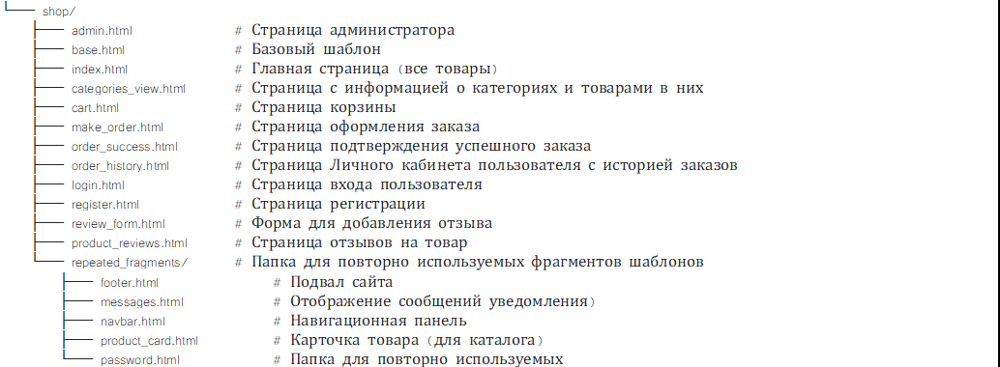

# FlowerDelivery Final Project

## Описание проекта
Этот проект представляет собой интернет-магазин по доставке цветов и телеграм-бот, 
который получает информацию о заказах и о смене статуса заказа.

### Функционал магазина
- Главная страница со всеми товарами.
- Регистрация и авторизация пользователя.
- _Личный кабинет_ пользователя с его данными, возможностью их правки и просмотра _Истории заказов_.
- В _Личном кабинете_ пользователь может зарегистрироваться в боте магазина и тогда будет получать информацию о своих заказах.
- В _Истории заказов_ реализована возможность повторить заказ. При повторном заказе он автоматом заносится в Корзину и открывается ее страница.
- Страница _Каталога_ с товарами в виде карточек, сгруппированных по подкаталогам.
- Выбор товара и добавление в Корзину. 
- В _Корзине_ возможна правка количества товаров и правка данных о доставке (по умолчанию они берутся из данных пользователя).
- Оформление заказа с сохранением данных в базе данных.
- Аккаунт администратора для смены статуса заказа. Логин (обязательно при регистрации админа д. б., если БД будет заново создаваться): admin. Сейчас пароль - adminadmin1.
- Поддержка отзывов и рейтингов.


### Telegram-бот
- Бот создан с использованием `aiogram`.
- Отправляет данные о заказе, его составе и смене статуса заказа пользователю, зарегистрированному в Телеграм-боте с сайта цветов.

---

## Установка и настройка
1. Клонируйте репозиторий:
   ```bash
   git clone https://github.com/Sophiya-ai/FlowerDelivery.git
   cd FlowerDelivery
   ```

2. Установите зависимости:
   ```bash
   pip install -r requirements.txt
   ```

3. Настройте базу данных (вы должны быть в папке джанго-проекта website). Если БД создаете свою, то надо создать папку и файл БД, а также провести миграции:
   ```bash
   cd website   
   python manage.py migrate
   ```

4. Запустите сервер (вы должны быть в папке джанго-проекта website):
   ```bash
   python manage.py runserver
   ```

5. Настройте и запустите бота:   
     
   - Добавьте токен своего бота в bot/config.py или используйте моего:
     ```bash
     BOT_TOKEN="your-bot-token"
       ```
     
   - Запустите бота из директории bot:
     ```bash
     cd bot
     python bot.py
     ```
---

## Структура проекта FlowerDelivery

- **bot/** — папка с кодом Telegram-бота.
- **db/** —  папка с файлом БД (db.sqlite3` — база данных (SQLite))
- **website/** — папка Django-проекта.
  - `staticfiles/` — содежит статические файлы (важен для правильной работы WhiteNoise).
  - `templates/` — HTML-шаблоны (описаны на рисунке):    
        
  - `shop/` — приложение магазина.
  - `media/` — медиа-файлы. 

---

## Требования
- Python 3.9+
- Django 5.1.4+
- aiogram 3.0+

---

## Лицензия
Проект распространяется под лицензией MIT.

